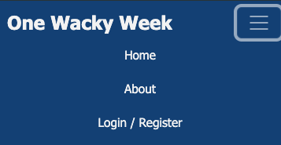
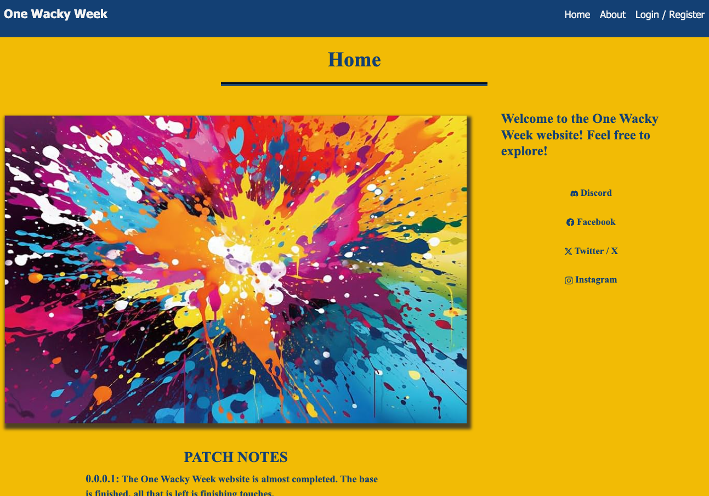
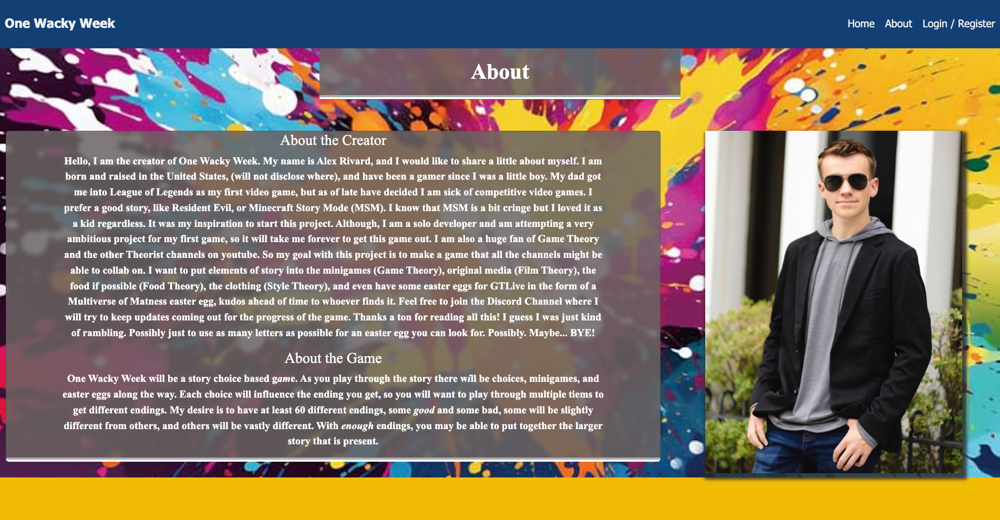
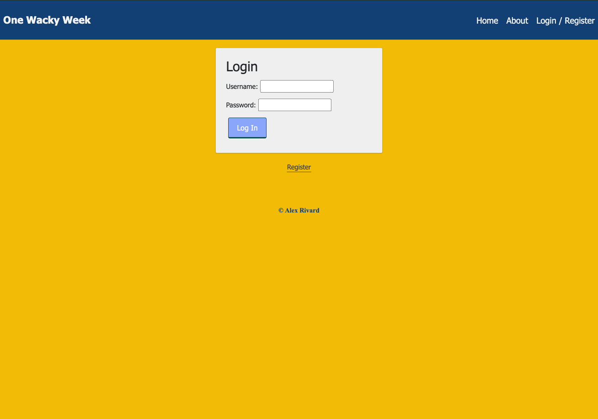
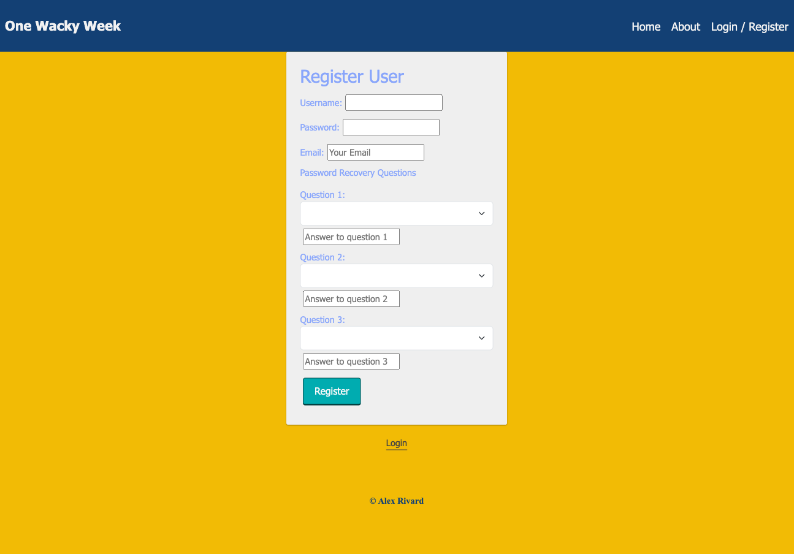
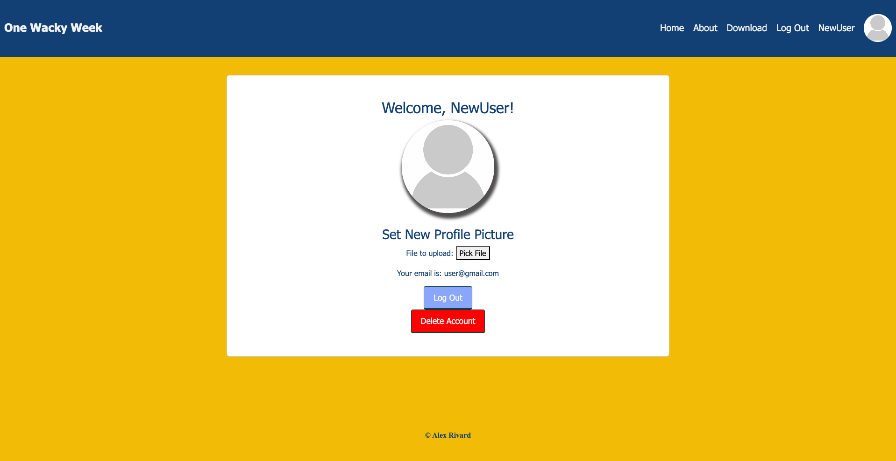
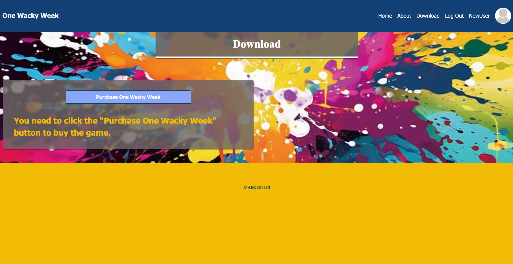
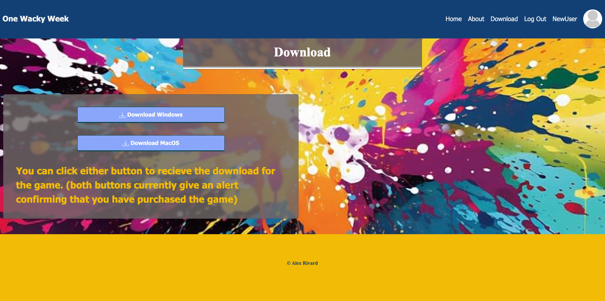

# One Wacky Week Download Site

A website that will be used in the future for selling the video game I am going to make.

## Description

If you want to create a copy of this code and get it working on your computer, you will need to `npm install`, `npm run server`, and `npm run client`. You will also need to create a .env file that will hold your own stripe and cloudinary secrets
- 'SERVER_SESSION_SECRET'
- 'GAME_COST'
- 'VITE_CLOUDINARY_NAME'
- 'VITE_CLOUDINARY_UPLOAD_PRESET'

Every page has the Navbar displayed at the top and it is setup for desktop and mobile view
- There is a `Login / Register` button that will be replaced with the user's username and profile picture upon login, and if that is clicked the user will be taken to the user page.
- The Navbar has a `download` link that will navigate to the download page and will only show up if the user is logged in.
- The `about` link navigates the user to the about page.
- The `home` link navigates the user to the home page.
- When a user is logged in a `Log Out` button will appear and when clicked will log out the user.

The first image here is how the Navbar looks on desktop, the second it how it looks on mobile.

The Home/Landing page is the first page that a user sees
- The game's patch notes are displayed on the page from most recent to oldest.
- Some game art is to be displayed above the patch notes.
- The creator's socials are displayed here.

The About page is one of the four pages accessible without needing an account
- Information about the creator and the game are found on this page.
- Some different game art is to be here as the background of the page.
- A few easter eggs are to be hidden here.

The Login page is another of the four pages accessible without needing an account
- The user logs into their already made account here
- The user can switch to the registration page to create a new account
- Upon login the user is taken to the user page

The Registration page is another of the four pages accessible without needing an account
- Here is where a user creates a new account
- Recovery questions will be used for password recovery in the future (will be done before deployment)
- Email verification will be refined in the future
- Upon login the user is taken to the user page

The User page is where the user can view their profile information
- The user can change their profile picture here
- The user can also "delete" their account here. (Deleting here really just flags the account to be deleted on the Admin's account table)
- User will also be able to logout here

The Pre Purchase Download page is where the user can purchase the game
- The user can click purchase to be taken to strip to buy the game
- After making the purchase the user will see the Post Purchase Download page
- The game trailer will be here.

The Post Purchase Download page is where the user can purchase the game
- The user can click either of the download buttons to download the game, one for Windows and one for MacOS.
- The game trailer will be here as well.

