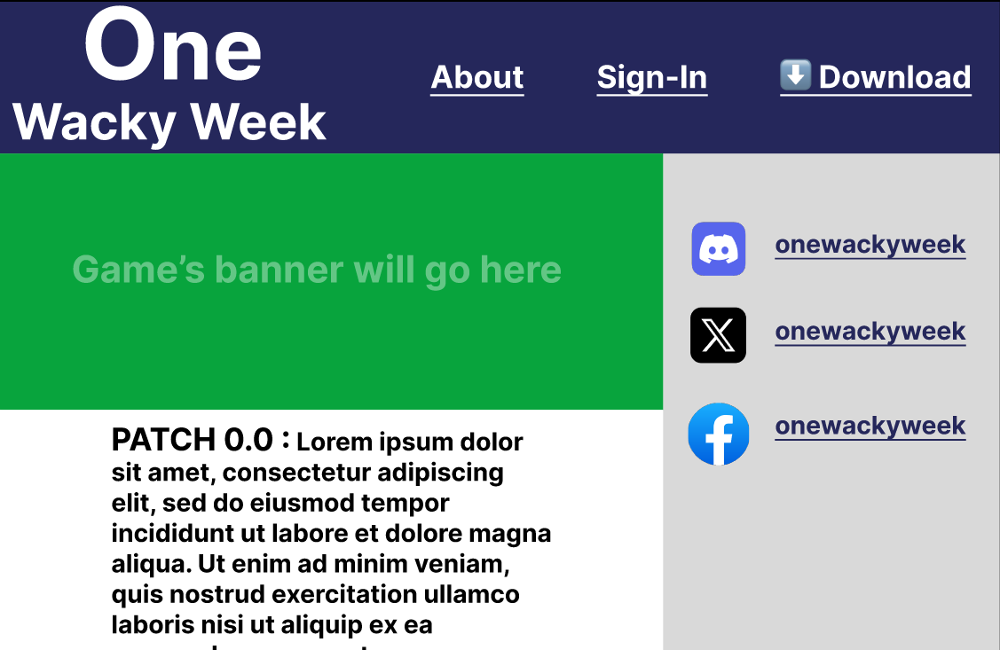

# One Wacky Week Download Site

A website that will likely be used in the future for selling the video game I want to make.

## Description

Every page will have the Navbar displayed at the top
- There will always be a `sign-in` button, will be replaced with the user's username and profile picture upon login.
- The Navbar will have a `download` link that will navigate to the download page.
- The `about` link will navigate the user to the about page.
- The `home` link will navigate the user to the home page.

The Home/Landing page is the first page that a user will see
- It will have a Navbar which will have links to the about page, the download page, and the sign-in page.
- The game's patch notes will be displayed on the page from most recent to oldest.
- The game's banner which will be displayed above the patch notes
- The creator's socials will be displayed, since all I have and use is Discord, it will be the only listed social.

